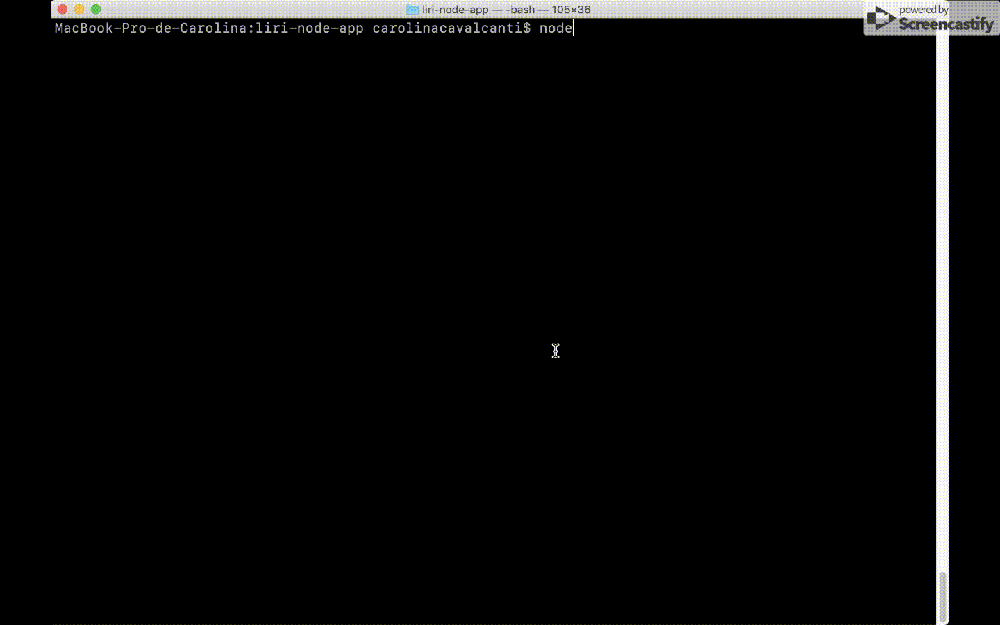
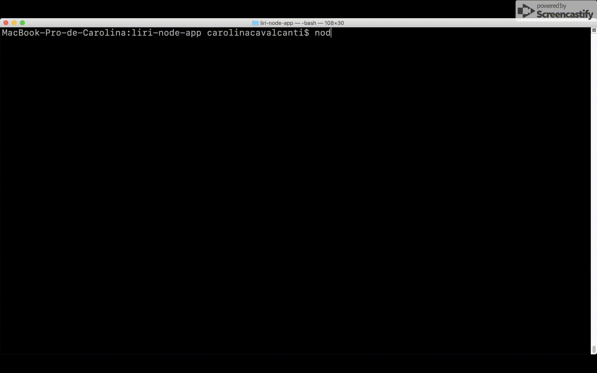

# LIRI

LIRI is a command line node app that takes in parameters and gives you back data.

## How It Works

**`node liri.js <command> <parameter>`**

LIRI can take one of the following commands:

Command | Parameter | Description
------------ | ------------ | ------------
concert-this | `<band/artist>` | Show band/artists events from the Bands in Town API 
spotify-this-song | `<song>` | Show tracks from the Spotify API
movie-this | `<movie title>` | Show movie information from OMDB API
do-what-it-says |  |  Execute the command stored in the random.txt file with the format "comand,argument"

### Examples

**`node liri.js concert-this Alanis Morissette`**



**`node liri.js spotify-this-song ironic`**


**`node liri.js movie-this anaconda`**



**`node liri.js do-what-it-says`**


## The log.txt file

LIRI appends every command and its data into the **log.txt** file.


## Instructions for the API keys

Create the **.env** file on the root with the following structure:
```
SPOTIFY_ID=YOUR_SPOTIFY_ID
SPOTIFY_SECRET=YOUR_SPOTIFY_SECRET
OMDB_KEY=YOUR_OMDB_KEY
BANDSINTOWN_KEY=YOUR_BANDSINTOWN_KEY
```
